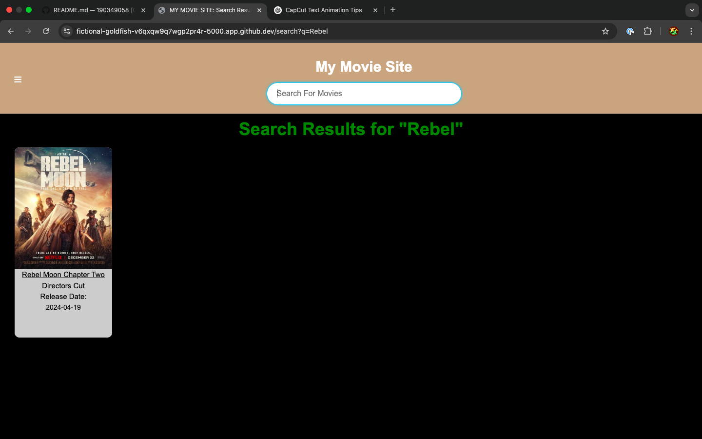
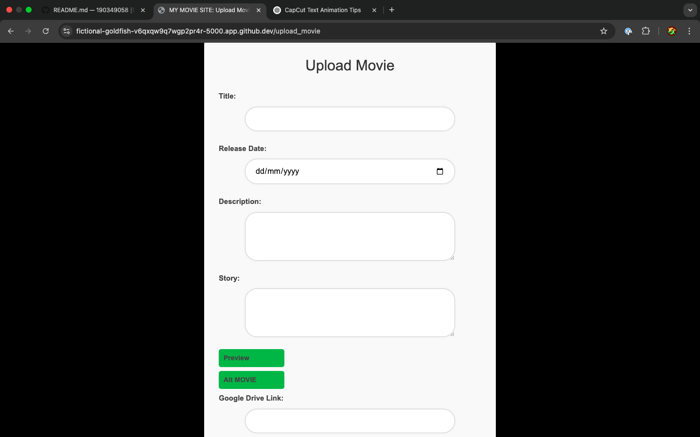
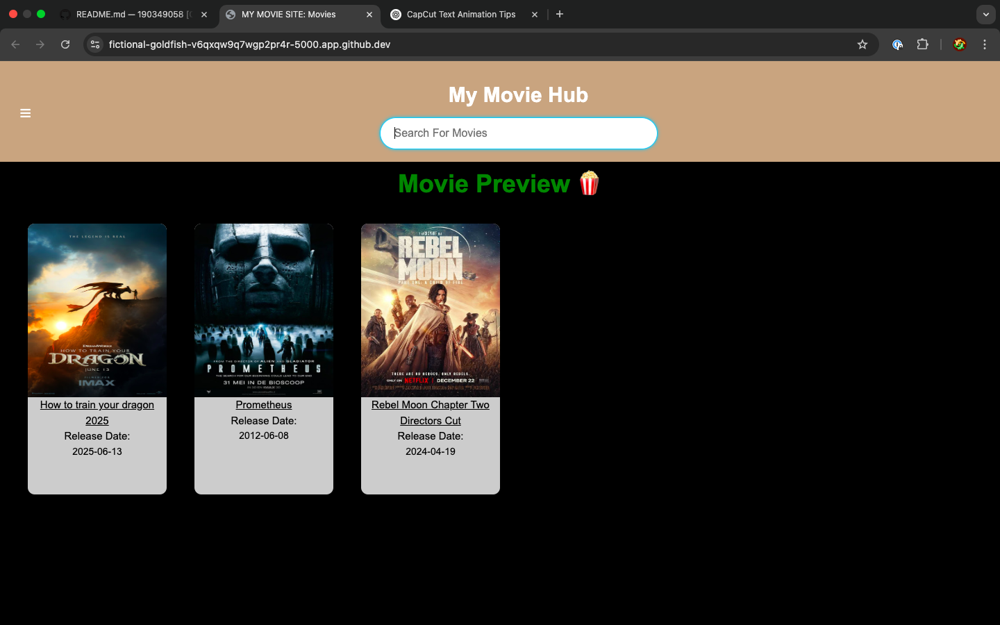
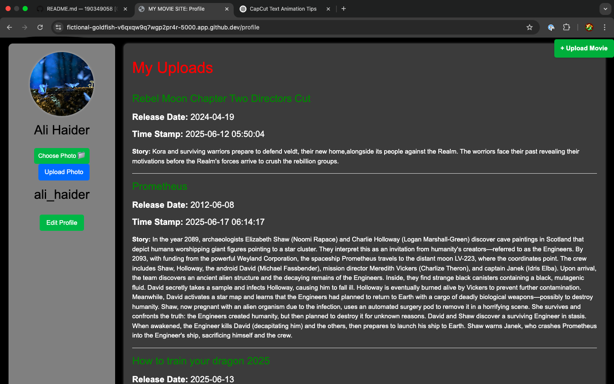

# 🎬 MyMovieHub – Your Gateway to Movie Magic!

#### 📽 Video Demo: [Click here to watch the demo](https://youtu.be/Tbrmleaw-r4?si=zVaqQcYyZyS_3bl9)

---

## 📖 Description

**MyMovieHub** is a dynamic, full-featured **full-stack web application** built from scratch using:

- 💻 **Backend:** Python (Flask), SQLite
- 🎨 **Frontend:** HTML5, CSS3, JavaScript
- 🗂️ **Database:** SQL (SQLite)
- 🧠 **Templating:** Jinja2
- 🖼️ **Storage:** Google Drive & local static folders

> 💡 This project allows users to **upload, manage, preview, and download movies** — all in a clean, mobile-friendly web interface that’s easy to use and visually compelling.

---

## 🌐 Live Features Overview

> Let’s take a walk through what MyMovieHub offers:

### ✅ 1. **Home Page (Movie Preview Grid)**
- Displays all uploaded movies with posters, titles, and release dates.
- Click any movie to **view detailed information and download** from Google Drive.

---

### ✅ 2. **Search Functionality**
- Type **any part of a movie title** in the search bar.
- Returns all matching results (e.g., typing `moon` shows `Moon Knight`, `Rebel Moon`, etc.).

**⬇️ Screenshot:**
> 

---

### ✅ 3. **Upload Page**
- Authenticated users can upload a movie by providing:
  - 🎬 Title
  - 📆 Release Date
  - 📝 Description and Story
  - 🖼️ Poster image
  - 🔗 Google Drive movie link

- Files are saved with secure filenames and stored inside a `movie_posters` folder.

**⬇️ Screenshot:**
> 

---

### ✅ 4. **Movie Detail Page**
- Beautifully styled movie detail layout with:
  - Poster on the left
  - Description, release date, and story on the right
  - 💾 Download button (linked to the Google Drive file)

**⬇️ Screenshot:**
> 

---

### ✅ 5. **User System**
- 🔐 Registration and login system using sessions.
- Users can:
  - Upload movies
  - View their own uploads
  - Update profile details (like avatar)

**⬇️ Screenshot:**
> 

---

## 🏗️ Tech Stack

| Layer        | Technology        |
|--------------|-------------------|
| Frontend     | HTML, CSS, JS     |
| Backend      | Python (Flask)    |
| Database     | SQLite (SQL)      |
| Templating   | Jinja2            |
| Hosting Files| Google Drive & Static Folder |
| UI Styling   | Custom CSS + Icons |

---

## 🛠️ Key Concepts Used

- Flask routing & templating (`@app.route`, `render_template`)
- SQL queries (INSERT, SELECT, LIKE, JOIN)
- Secure file upload via `werkzeug.utils.secure_filename`
- Auto-incrementing unique movie IDs
- Dynamic search using SQL `LIKE`
- Form handling via POST/GET
- Session management for authentication

---

## 📱 Responsiveness

The entire site layout is built to be **mobile-friendly** and responsive. Posters resize, text adapts, and layouts adjust on phones and tablets.

---

## 🔐 Security Measures

- 🔐 Input validation & escaping
- 🧼 Safe filename handling
- 🔐 User-level access for profile pages and uploads

---

## ✍️ Future Improvements

- 🌟 Add star rating or like feature
- 💬 User comments on movies
- 📥 Download analytics (track views/downloads)
- 🌐 Internationalization support
- 🔎 Advanced filtering (genres, years)

---

## 💬 Why This Project is Special

This wasn’t just a basic website — it was a **full-stack journey** from scratch. I designed every feature, wrote every route, handled databases, secured file uploads, and turned an idea into a real, functioning movie platform.

It proves that with time, dedication, and continuous debugging — **anything is possible in code.**

---

## 🚀 Run the Project Locally

```bash
# 1. Clone the repo
git clone https://github.com/tallalsajjad/MyMovieHub.git
cd MyMovieHub

# 2. Create a virtual environment and activate
python3 -m venv venv
source venv/bin/activate  # On Windows: venv\Scripts\activate

# 3. Install requirements
pip install -r requirements.txt

# 4. Run the app
flask run
